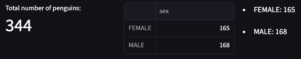

# Exercise 1

Create three columns.
- In the first column, display the total number of penguins using st.metric.
- In the second column, display a dataframe showing the numbers of male and female penguins.
- In the third column, display a list showing the numbers of male and female penguins.

Your output should look like this:    
    

